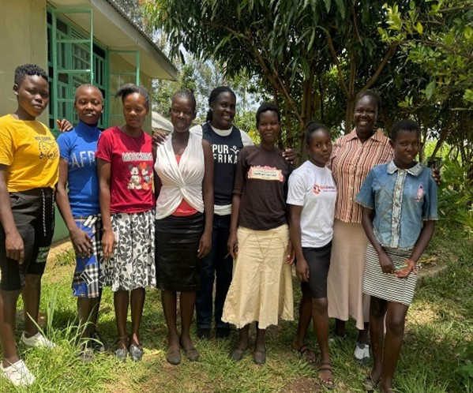
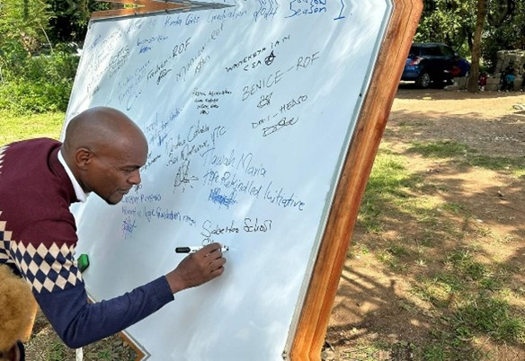
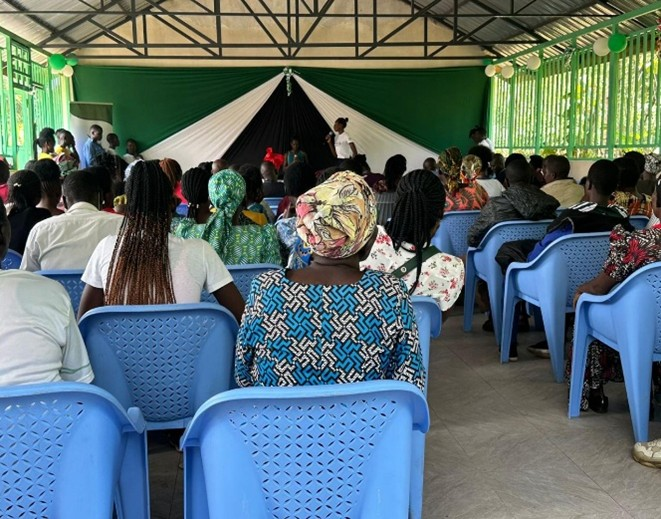
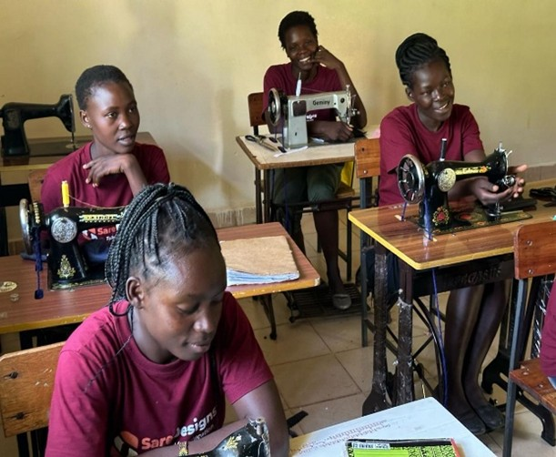
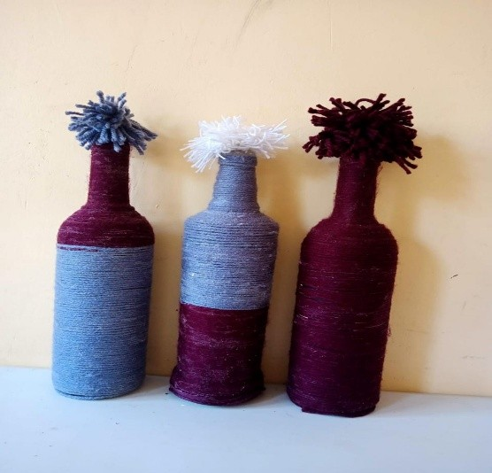
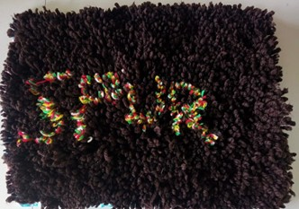

\fancypagestyle{myCoverStyle}{
  \fancyhf{}
  \renewcommand\headrulewidth{0pt}
  \fancyfoot[R]{\thepage}
  \fancyfoot[C]{\em{Cover picture : Graduation of Kinda Girls. The area Chief was the guest of honor.}}
  \fancyfootoffset{3.5cm}
}
\thispagestyle{myCoverStyle}

::: {.content-hidden}
% the default style is defined in _extensions/nrennie/PrettyPDF/PrettyPDF.tex
% and then set in _extensions/.../pagestyle.tex
% however, for the very first page we want to describe what is in the cover page
:::

## Kinda Girls Program (school-age mothers)

Kinda Girls program is designed to offer a safe environment for young mothers (mostly teenagers) and empower them to reach their full potential. The name *‘Kinda Girls’* is a Luo word meaning *‘Working hard without giving up’*. The name was chosen as a reflection of what the program is meant to achieve. The program is tailored towards addressing stigma and giving hope to the young teenage mothers (girls between ages 12 and 19) who become pregnant and mothers while still in school.

{fig-align="center"}

### Activities and Outputs

Twenty (20) girls participated and completed the training sessions. Seventeen (17) girls participated and and completed 'Part 1' training sessions.

The following topics were taught in the last six months: 

-   Challenges faced by young mothers

-   Sexual and reproductive health

-   Gender-based violence

-   Interpersonal communication skills

-   Self-esteem, priority setting, accountability

-   Age-appropriate business skills

#### Resources and inputs

-   Spur staff, financial resources (funds), training facilitators and mentors.

{fig-align="center"}

### Outcomes and Impact

Community building:

-   There is a positive behavior change within the girls in the program, this was pointed out by the parents of the girls as well as the community leaders.

-   There is increased trust in Spur Afrika programs in Kisumu. More and more parents are referring their younger daughter to Spur Afrika for mentorship.

{fig-align="center"}

Vocational education:

-   Eight girls graduated in tailoring and dressmaking at Akili school in November 2024.

Restarting school:

-   One girl who was rescued from early marriage and taken back to is going on well wither education, her school performance if good and she is progressing to Form 2.  

<!-- -->

-   1 girl who became a mother due to defilement is now joining Junior Secondary School next year 2025, her mother shall help take care of the grandchild.

{fig-align="center"}

### Challenges faced in the last six months

-   Most of the teen mothers are willing to go back to school or join Technical (TVET) colleges but they lack school fees. Spur Afrika is not able to fully support them for currently due to budget constraints. 

-   The girls are having difficulties to access basic needs like pampers, sanitary towels and clothes for their children, this puts them in risk of engaging in unequal or inappropriate relationships with men who can provide for them.

::: {#fig-artwork layout-ncol=2}

Teenage mothers works showcased after skills training
:::

### Plans for the next six months

-   To enrol fewer girls to the program and work on providing more holistic support to those who are enrolled.

-   Have more talks that emphasize the importance of self-care and increase awareness on age-appropriate empowerment activities. 

## Finances

-   Funds used so far in the last 6 months is **Ksh 100,000 (AUD 1,250).** The budget allocated to the program was sufficient to cover all the cost of activities set for 2024. Based on the challenges/concerns raised by the teenage mothers, an upward review of the budget is required.

## Editors

Dr. David P.S. Fong (Monitoring, Evaluation and Learning)

## Contact

Olympic Estate House No. 166

P.O. Box 44473-00100

Email: info\@spurafrika.org

Web: [www.spurafrika.org](https://www.spurafrika.org)
