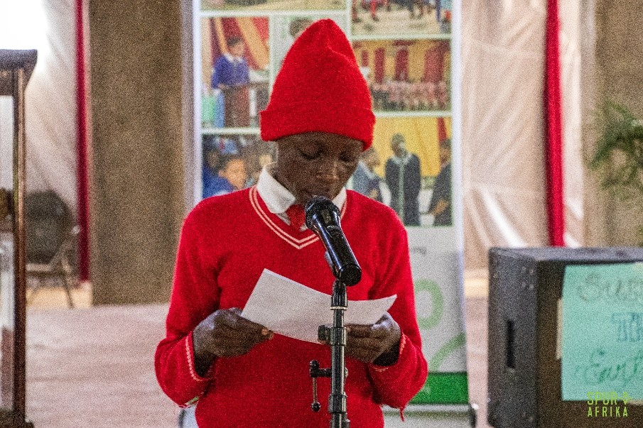
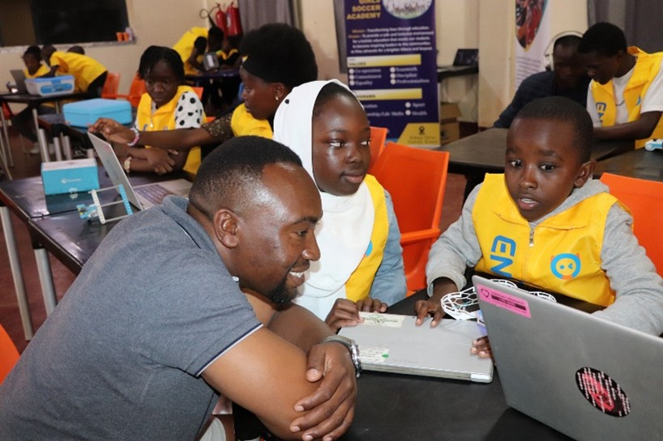
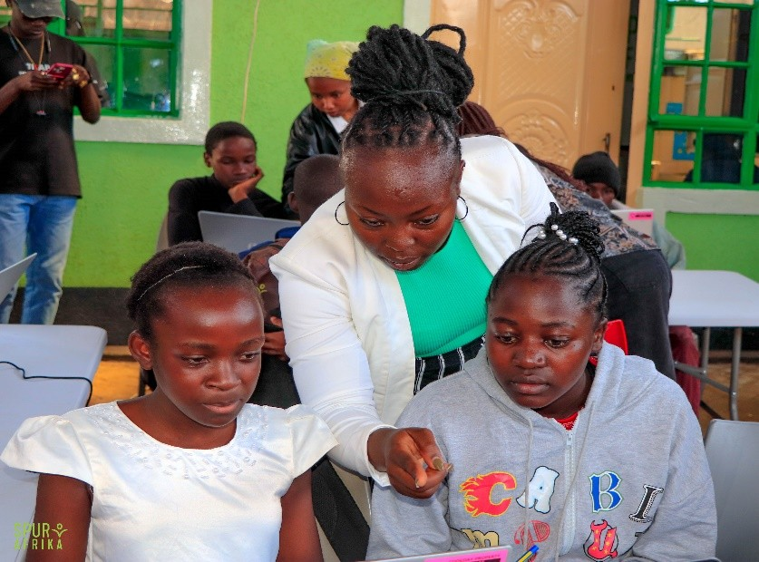
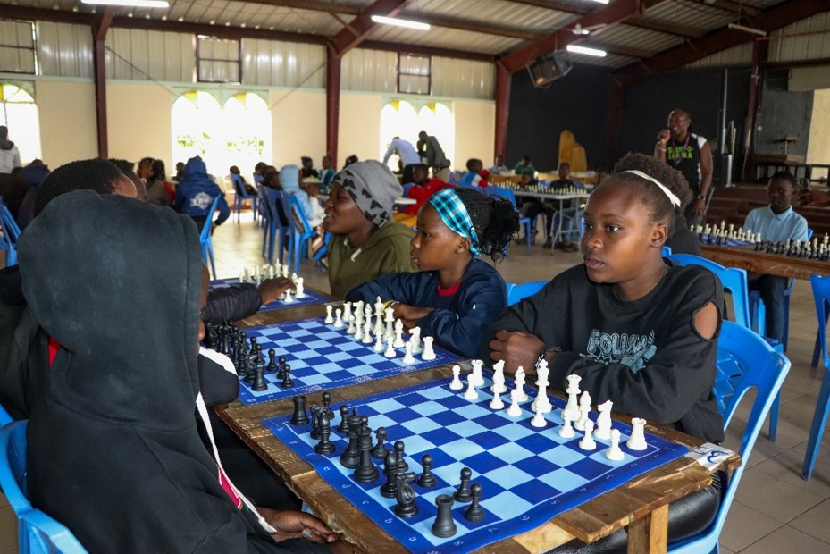
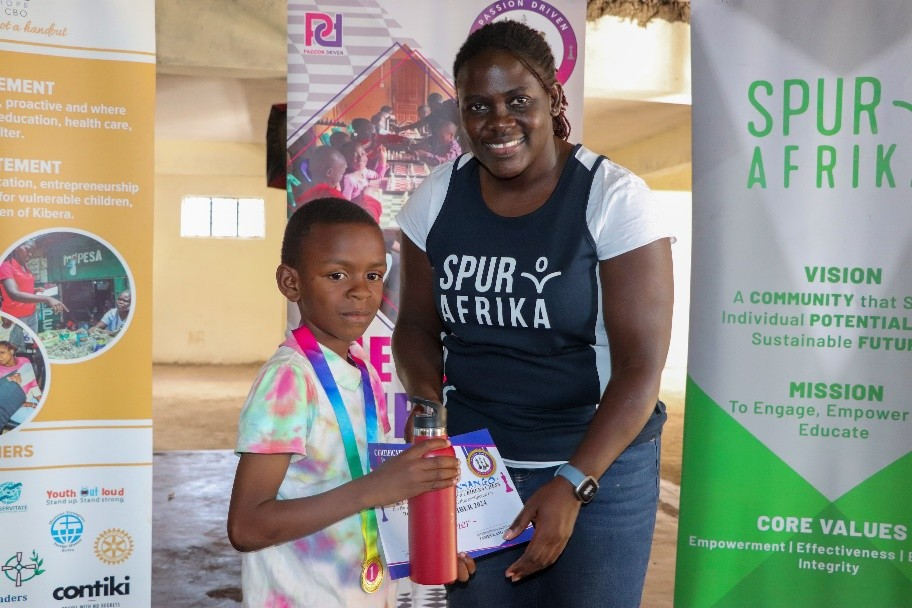
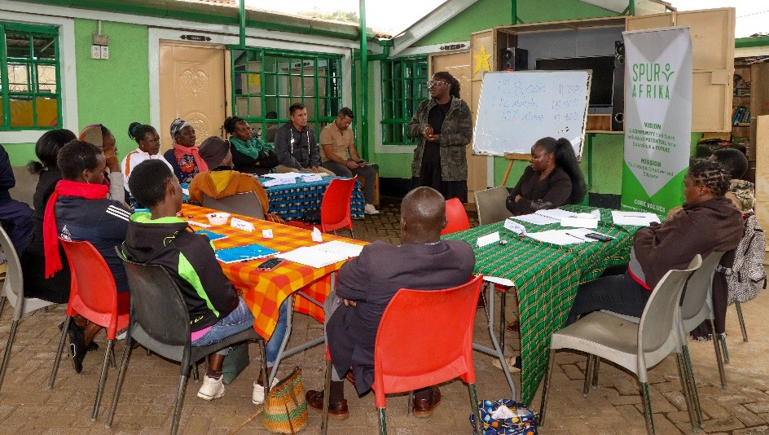
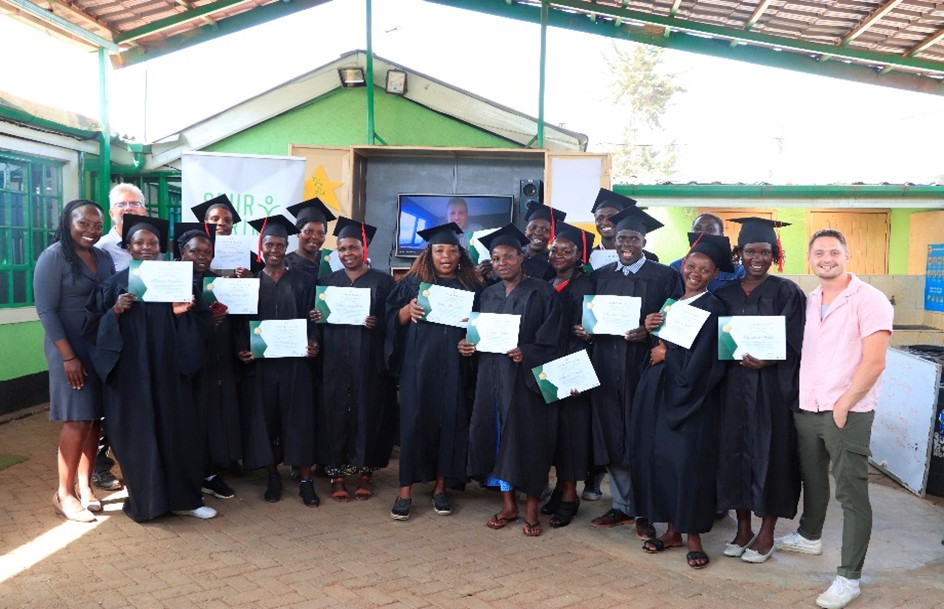
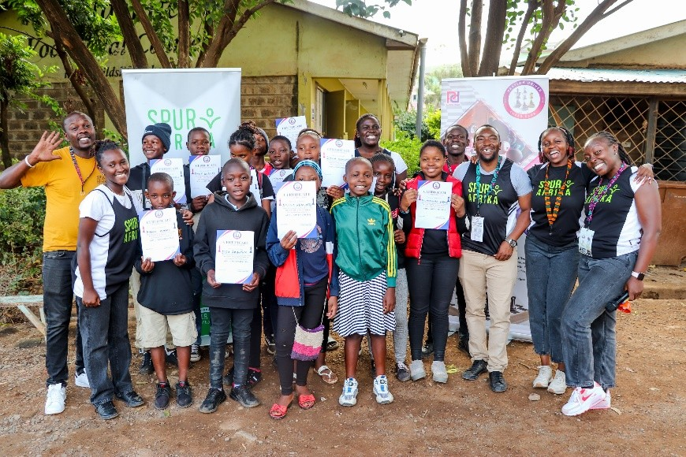

\fancypagestyle{myCoverStyle}{
  \fancyhf{}
  \renewcommand\headrulewidth{0pt}
  \fancyfoot[R]{\thepage}
  \fancyfoot[C]{\em{Cover picture : Ri-Ki competition -- Students showcasing the drawings showing their solution for climate issues}}
  \fancyfootoffset{3.5cm}
}
\thispagestyle{myCoverStyle}

## RI-KI

RI-KI (Read It Know It) is an educative program with the objective to grow the reading culture and to help build children’s confidence and courage in self-expression in children from an early age, more so in underserved communities like Kibera.

The event involves coordinated themed competition events (trivia questions, choral verses, themed artwork, traditional dances etc.) that are held twice a year.

Spur Afrika held phase II of the RI-KI competition in Kibera (KAG Educational Centre) with attendance from 7 schools. The event’s theme was **Climate Action** (Sustainable Development Goal 13), teaching children that they are capable of making positive change by themselves in their particular surrounding. The schools had 15-20 children per school preparing various activities based on the theme. Among the judges of the competition was an environmental conservatist from Octavia Carbon and the head of the Rowallan Scouts Camp.

{fig-align="center"}

#### Input and Resources

-   8 Spur staff members and two volunteers

-   3 Judges. Adjudicators with knowledge of the theme

-   Finances

-   Teachers

### Output

-   7 schools and 300 students (participants and supporters) participated.

-   The three schools with the highest marks in the art work presentations, trivia and choral verses received trophies.

-   More students participated in the different activities compared to the previous RI-KI events.

-   All participating students received a prize which was a brush and toothpaste, courtesy of our partners Colgate. 

### Outcome and Impact

-   The competitions enhance creativity and social development as well as physical well-being. Children can think critically and develop solutions by themselves based on the practice they get from participating in the RI-KI program. They can therefore be better decision makers in future.

-   The teachers have embraced the competition and have reported that some students are showing improved academic performance at school. 

## Coding Program

With the rise in technology, there is need to train the children to enable them have a familiarity – or even a competitive advantage – with in-demand computer skills. Twenty of the pre-teens and teenage students being sponsored by Spur Afrika embarked in participating in learning coding through the Python language. Recently, five more of the children joined in, having learnt different ways of coding including game design using Scratch. The children were taught by an engineer from Code With Kids, the sessions were held at the Spur Afrika Centre. Coding projects included game design and robotics.

{fig-align="center"}

### Activities and Outputs

-   Coding sessions

    -   25 students participated in the Coding Program which took place during weekends in October and one week in November.

-   Game design classes

-   Coding – Enjoy AI Competition

    -   4 of the children attended a robotics and coding competition

#### Inputs and Resources

-   1 trainer/teacher, 1 volunteer and Spur staff 

-   Finances

### Outcomes and Impact

-   The children accepted the new challenge and acquired a distinct and intricate knowledge of coding.

-   The children began working on designing an online Game and were excited to see the results of their work.

-   There is an enhancement of the childrens' problem-solving skills and improvement in math and computation thinking.

-   Four children participated in a Coding competition where they used coding to do different things like flying drones.

    -   The exposure to coding competition with other children in the tournament gave the children a wider perspective of how diverse coding is and boosted their confidence.

-   It is expected that some of the 25 students who participated in the coding program have great potential of choosing a career based on their coding skills.

{fig-align="center"}

#### Challenges

The coding program is growing quickly since more children are interested in the program. There needs to be enough computers for the children to practice what they are learning.

## Chess classes and Chess tournament

#### Activities and Output

Chess is a game that helps children broaden their thinking and exposes them to idea generation at an early stage. Spur Afrika held chess classes at the Spur Afrika Centre during the holidays for interested students. Ten training classes were held. Eighteen students participated in chess classes. The classes were taught by 5 trainers from Passion Driven Chess Club.

At the end of the year in November, Spur Afrika, in conjunction with the Passion Driven Chess Club and 18 volunteers (including Spur Afrika staff), held a Chess Tournament at a nearby school (KAG Primary School). 96 children participated from different chess clubs in the area. All participants received certificates of participation. The best three children in each category (Under-10, Under-12, Under-14 and Under-18) all received a medal and gifts. One girl from Spur Afrika received a medial for being one of the best in the under-14 category for girls. The best overall also were awarded a water bottle donated by a friend of the partners. The partners also helped get the chess boards and medals for the competition.

{fig-align="center"}

#### Outcomes and Impact

Through training, the children gained basic knowledge of chess and the rules that apply to chess. The students enjoyed the training sessions and gained confidence in playing chess. The children were challenged and motivated to become skilled chess players.

The chess tournament brought a feeling of togetherness and partnership for a good cause and also the chance of children to actively learn from each other and challenging one another.

{fig-align="center"}

The children gained confidence and boldness in decision-making through critical thinking. Training in focus and discipline will improve their school work.

#### Challenges

There is a need for chess boards which are necessary and helpful when tournaments are held.

## BAM (Business as Missions)/Msingi training program

With the rise in need because of the current poor economic situation, Spur Afrika endeavours to empower the women and young people in the community they serve through business trainings. This program is done in partnership with Business Coaches from Business As Missions, Iowa, USA. 

#### Activity and Output

The trainings happen in 3 phases where the trainees receive wholesome learning about business and how to keep their businesses sustainable. Successful candidates are able to get financial support to grow their business. 

15 people registered for and attended the business training through a four-month period. Nine trainers from Iowa helped facilitate the program, assisted by Spur Afrika staff and volunteers. 13 of the 15 trainees finished up to Phase 3, graduated and received a certificate. Five of the business people received loans and were appreciative of the boost to make their businesses better.

{fig-align="center"}

#### Outcome and Impact

The trainees enjoyed the sessions and all learnt how to do business well and maintain good standards. They appreciated the skill of record keeping which they started in their businesses.

As the result of training and empowerment to do business for profit there will be a reduction in poverty.

{fig-align="center"}

## Budget update

-   The budget for all the special programs cost was **Shs. 600,000/AUD 7,100**. This included the cost of one worker. The business training costs were funded by the facilitators.

## Plans for the next six months

-   Spur Afrika Medical camp to be held at the beginning of the year, January 2025.

{fig-align="center"}

## Editor

Dr. David Fong (Monitoring, Evaluation and Learning)

## Contact

Olympic Estate House No. 166

P.O. Box 44473-00100

Email: info\@spurafrika.org

Web: [www.spurafrika.org](https://www.spurafrika.org)
