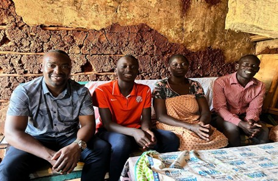
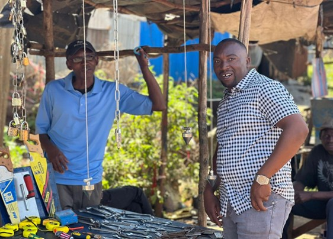
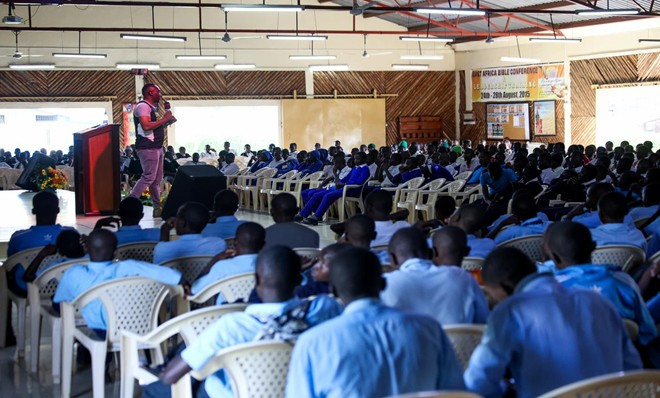
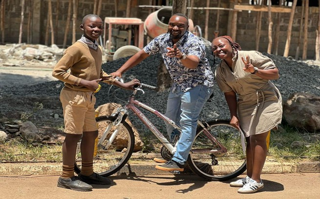

\fancypagestyle{myCoverStyle}{
  \fancyhf{}
  \renewcommand\headrulewidth{0pt}
  \fancyfoot[R]{\thepage}
  \fancyfoot[C]{\em{Cover picture : Sponsored children and Spur staff dancing to music at picnic (Rowland's Scouts Camp)}}
  \fancyfootoffset{3.5cm}
}
\thispagestyle{myCoverStyle}

## Introduction

The Elimisha Sponsorship Program is a community-based educational initiative dedicated to supporting vulnerable children in the Kibera community, particularly those who are orphaned or come from extremely low-income families. The core mission of the program is to **educate**, **empower**, and **engage** these children, equipping them with knowledge and life skills for a more sustainable and independent future.

As of June 2025, the Elimisha Program in Kibera is supporting a total of **120 children**, comprising of **62 girls and 58 boys**. These students are distributed across various levels of education: 

-   **44 children** are currently enrolled in Primary School.

-   **46 students** are attending High School.

-   **19 learners** are pursuing higher education in Universities and Colleges across the country.

-   **10 learners** will be joining Universities and Colleges in September this year.

-   **1 learner** has opted out, she will not proceed to join College in September.  

**87 of the students** are in **public schools** and **33 are enrolled in private institutions**, the placement is done depending on the students’ specific needs, academic performance, and parent/guardian preferences. The Elimisha Program uses a holistic approach; besides payments of school fees, Spur Afrika also provides access to medical care, mentorship, picnic activities and Annual retreat camp for all learners in the Program. 

Spur Afrika works closely with parents, guardians, local schools, mentors and community leaders to monitor the academic progress and well-being of the beneficiaries, with the long-term goal of breaking the cycle of poverty through education and mentorship.

{fig-align="center"}

## School Update

### Activities and Outputs

-   All the basic school fee payments have been done up to date, this was done at the beginning of every school Term.

-   All sponsored children in Primary and Secondary School have received a set of new school uniforms.  

<!-- -->

-   62 families of the sponsored children were visited in the last six months.

-   We have helped 35 families do a business training and found partners who gave them small capital to start small businesses. Two families lost their loved ones and they are still in the process of grieving.

{alt="Visiting the parent of one of the sponsored student at his business" fig-align="center"}

#### Inputs

-   Scholarships and financial aid

-   Mentors and leadership coaches

-   Staff and volunteers

#### Activities

-   School/ home regular check-ins

-   School fee payment

-   Tuition Classes

-   Mentorship meetings

-   Medical clinics

-   Picnic/Hike and hot lunch program

### Outcomes and Impact

-   Out of 110 students, 97 maintained regular attendance throughout the school term. Absenteeism was attributed to sickness (6), indiscipline (3 cases involving possession of illegal drugs), and loss of interest (3).

    -   There is a high rate in school attendance i.e. 88.2% but slightly lower than the same period last year. This is due to multiple students getting sick and increased indiscipline cases leading to suspension of some students.

-   Of the 110 students, 21 students’ performance was excellent (E.E), 57 students were above average (M.E), 16 students’ performance was approaching expectation (A.E) and 13 students’ performance was below expectation (B.E). Three (3) Students did not do the exams due to losing interest towards school.

-   Eleven students successfully completed high school. Ten (10) students who graduated from high school are set to join University/college in September. One student has opted out of further study. 

## University and College Update

Currently,7 sponsored students are enrolled in university. 13 are pursuing diploma or certificate courses. Of the 11 students who graduated from high school at the end of last year, 5 will proceed to university and 5 to college. One student has opted out of further education. 

The 10 new students who are to join college and university in September were able to complete and graduate from a five-month leadership and mentorship training conducted by a partner organization in Kibera.

Students who are in universities/colleges are coming back to the organization to volunteer and mentor the younger ones as a way of giving back to the community.

## School Holiday Program

-   Two recreational picnics were held at Rowallan Scouts Camp in January and April, giving children an opportunity to relax and bond before returning to school. The sessions included team-building games, mentorship talks, and hot meals. Mentors and parents participated in the April event, creating a stronger support network for the children.

-   16 sponsored children continued with computer coding classes.

-   12 children are participating in chess training to improve critical thinking. 

## Mentorship Update

### Activities and Outputs

The Mentorship and psychosocial support have remained integral components of the Elimisha Sponsorship Program. These services aim to provide emotional, Educational, social, and psychological support to the children while fostering character development and life skills. 

-   **Group Mentorship Sessions:** All sponsored children participated in two large group mentorship sessions facilitated by Spur Afrika team members. Key discussion topics included: Substance Abuse Awareness and Interpersonal Relationships and Social Boundaries.

-   **Individual Mentorship:** 67 children participated in 80 one-on-one mentorship sessions. Some children received more than one session depending on their needs and the complexity of the issues they faced. 

-   **Counselling Services:** Three students were identified as at-risk due to exposure to or
    involvement with illegal drug use. They were referred for individual counselling sessions with the program’s staff counsellor to provide targeted intervention and support. 

<!-- -->

-   **Targeted Group Mentorship:** Five additional specialized group mentorship sessions were conducted: 1 for high school students, 1 for junior school students,1 for boys only, 1 for girls only, 1 career mentorship session for post–high school students. The
    topics discussed included: Identity and Self-worth, Financial Literacy, Career Planning and Choices, Setting Personal Vision and Goals.

{alt="Nicholas (sponsorship manager) addresses students during a mentorship program" fig-align="center"}

#### Resources and inputs

-   Spur Staff & Volunteers

-   Finances

-   Mentors

-   Counsellors

### Outcome and Impact

-   Improved self-confidence and expression among sponsored children.

-   More children feel safe and free to share personal challenges and seek help.

-   Early intervention and counselling helped deter potential drug-related behaviour. 

-   Students demonstrated increased awareness of personal identity, future goals, and responsible social behaviour. 

## Medical Clinic and Health Treatment

In a one-day medical clinic in January, 106 (out of 120) Elimisha beficiaries attended and were screened by the doctors.

The clinic was held in partnership with Kibera Human Needs Project Clinic (Dr. Simiyu). Basic checks, including height and weight measurement, checking the temperature and measuring visual acuity were conducted with the assistance of volunteers. Volunteers and Spur staff also ran concurrent activities during the clinic, including art and colouring, oral hygiene awareness and teeth-brushing practice.

The general Health of the children has improved over the years, this year we had a few who had minor ailments like skin rashes, coughs and headaches which they were all helped. 

-   3 children had minor dental problems and were referred to a dentist.

-   6 students having eye problems, they were given eye glasses.  

Over the 6 months, 14 children got sick and received medical attention from a variety hospitals.

#### Resources and inputs

-   8 Spur staff

-   4 Doctors and 4 Nurses

-   12 Volunteers

-   Finances

#### Outcome and impact

-   More children are brushing their teeth correctly leading to a decrease in dental problems.

-   More children are intentionally aware of the “WASH” program (Water, Sanitation & Hygiene).

-   The general Children’s health has improved.

## Challenges faced in the last six months

-   Six parents are not actively involved in supporting their children's education.

-   Twenty-two families (18%) are facing economic hardship due to unemployment and high cost of living.

-   Two families lost their homes and school items in a fire incident.

-   One family experienced the loss of a loved one (Mother) due to prolonged illness.

-   Day school students missed classes for a few days due to anti-government protests. 

-   Twenty-nine students are underperforming academically due to low commitment.

-   Three students have lost interest in school; follow-up efforts are ongoing.

-   Three students were caught in possession of illegal drugs at school and were suspended.

## Budget update

Funds used so far in the last 6 months is **Ksh 4,697,640** which is approximately **AUD 53,000.** This includes cost of school fees paid in January to June, picnic costs in January and April, school uniforms, shoes and salaries of workers in charge of the program.

{fig-align="center"}

## Plans for next six months

Proposed spending in the next 6 months of 2025 is **Ksh 3,500,000**, which is approximately **AUD 40,000.** This includes a salary for the worker who is in charge of the program, one term of school fees to be paid in August/September 2025 and the end year camp that will be held in November. It is expected that 110 students and 15 Spur workers/Volunteers will attend the end year camp.

### Projected activities for 2nd Half of year 

1.  School fee payments for third school term

2.  School & Home Visit in September

3.  Annual Camp in November, Picnic and or Hot lunch in August

4.  Annual performance review of the children in November

5.  Christmas Bucket 

## Editor

Dr. David Fong (Monitoring, Evaluation and Learning)

## Contact

Olympic Estate House No. 166

P.O. Box 44473-00100

Email: info\@spurafrika.org

Web: [www.spurafrika.org](https://www.spurafrika.org)
